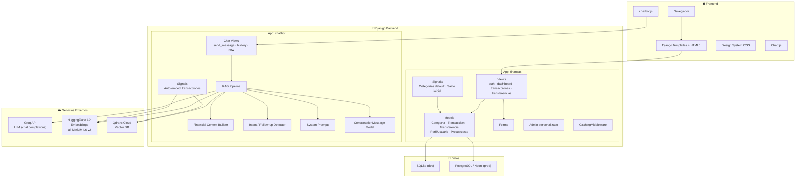
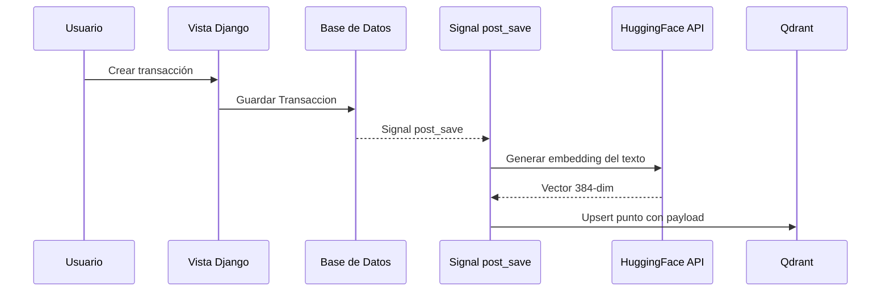
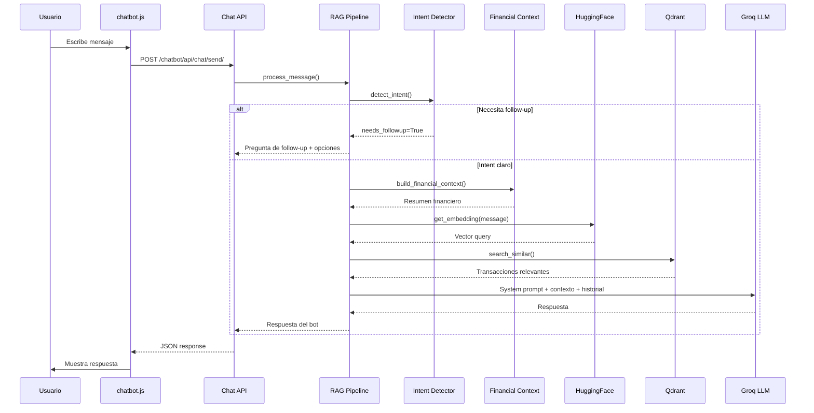

# 🏗️ Arquitectura — Money Manager

## Visión General

Money Manager es una aplicación web full-stack construida con **Django 5** que combina gestión financiera personal con un **asistente de IA conversacional (FinBot)** impulsado por una arquitectura RAG (Retrieval-Augmented Generation).



---

## Aplicaciones Django

### `finanzas` — App Principal

Maneja toda la lógica financiera: autenticación, dashboard, transacciones (ingresos/gastos), transferencias entre usuarios, presupuestos con alertas y categorización.

| Componente     | Descripción                                                                 |
| -------------- | --------------------------------------------------------------------------- |
| **Models**     | `Categoria`, `Transaccion`, `Transferencia`, `PerfilUsuario`, `Presupuesto` |
| **Views**      | `auth_views`, `dashboard_views`, `transaccion_views`, `transferencia_views` |
| **Forms**      | Formularios para transacciones, transferencias y registro                   |
| **Admin**      | Panel personalizado con filtros por usuario, gráficos y estadísticas        |
| **Signals**    | Creación automática de categorías default y saldo inicial al registrarse    |
| **Middleware** | `CachingMiddleware` para caché de recursos estáticos                        |

### `chatbot` — Asistente FinBot

Implementa un chatbot financiero inteligente con arquitectura RAG completa. Ver [documentación detallada](docs/CHATBOT.md).

| Componente   | Descripción                                                                                         |
| ------------ | --------------------------------------------------------------------------------------------------- |
| **Services** | RAG Pipeline, LLM Service, Embedding Service, Qdrant Service, Financial Context, Follow-up Detector |
| **Models**   | `ConversationMessage` — historial de conversaciones por sesión                                      |
| **Views**    | API REST para envío de mensajes, historial y nueva conversación                                     |
| **Signals**  | Auto-embedding de transacciones en Qdrant al crear/editar/eliminar                                  |
| **Prompts**  | System prompt configurable para el LLM                                                              |

---

## Stack Tecnológico

| Capa                   | Tecnología                                               |
| ---------------------- | -------------------------------------------------------- |
| **Backend**            | Django 5, Python 3                                       |
| **Frontend**           | HTML5, CSS3 (design system custom), JavaScript vanilla   |
| **Gráficos**           | Chart.js                                                 |
| **Iconos**             | Font Awesome 6                                           |
| **LLM**                | Groq API (compatible OpenAI)                             |
| **Embeddings**         | HuggingFace Inference API (`all-MiniLM-L6-v2`, 384 dims) |
| **Vector DB**          | Qdrant Cloud (cosine similarity)                         |
| **BD relacional**      | SQLite (dev) / PostgreSQL vía Neon (prod)                |
| **Hosting**            | Vercel (serverless)                                      |
| **Archivos estáticos** | WhiteNoise                                               |

---

## Flujo de Datos

### Transacción → Embedding (automático)



### Consulta al Chatbot (RAG Pipeline)



---

## Estructura de Directorios

```
money-manager-python/
├── chatbot/                    # App FinBot — Asistente IA
│   ├── models/
│   │   └── conversation.py     # ConversationMessage
│   ├── prompts/
│   │   └── system_prompts.py   # Prompt del asistente financiero
│   ├── services/
│   │   ├── rag_pipeline.py     # Pipeline RAG principal
│   │   ├── llm_service.py      # Cliente Groq API
│   │   ├── embedding_service.py# Cliente HuggingFace embeddings
│   │   ├── qdrant_service.py   # Cliente Qdrant vector DB
│   │   ├── financial_context.py# Constructor de contexto financiero
│   │   └── followup_detector.py# Detección de intención y follow-ups
│   ├── templatetags/           # Template tag para widget
│   ├── views/
│   │   └── chat_views.py       # Endpoints API del chat
│   ├── signals.py              # Auto-embedding de transacciones
│   └── urls.py
│
├── finanzas/                   # App principal — Gestión financiera
│   ├── admin/                  # Admin personalizado
│   ├── forms/                  # Formularios de entrada
│   ├── models/
│   │   ├── categoria.py        # Categorías de ingreso/gasto
│   │   ├── transaccion.py      # Transacciones financieras
│   │   ├── transferencia.py    # Transferencias entre usuarios
│   │   ├── perfil_usuario.py   # Perfil con preferencias
│   │   └── presupuesto.py      # Presupuestos por categoría
│   ├── views/
│   │   ├── auth_views.py       # Login, registro, logout
│   │   ├── dashboard_views.py  # Dashboard con gráficos
│   │   ├── transaccion_views.py# CRUD de transacciones
│   │   └── transferencia_views.py # Transferencias
│   ├── middleware.py           # CachingMiddleware
│   ├── signals.py              # Categorías default + saldo inicial
│   └── urls.py
│
├── money_manager/              # Configuración del proyecto
│   ├── settings.py             # Settings con auto-detección de entorno
│   ├── urls.py                 # Rutas raíz
│   ├── wsgi.py / asgi.py
│   └── __init__.py
│
├── templates/                  # Plantillas HTML
│   ├── base.html               # Layout base con navbar + chatbot widget
│   ├── chatbot/
│   │   └── chatbot_widget.html # Widget flotante del chatbot
│   └── finanzas/               # Plantillas de la app
│       ├── dashboard.html
│       ├── login.html / register.html
│       ├── transacciones/
│       └── transferencias/
│
├── static/
│   ├── css/
│   │   ├── styles.css          # Design system principal
│   │   └── chatbot.css         # Estilos del chatbot
│   └── js/
│       └── chatbot.js          # Lógica del widget chatbot
│
├── docs/                       # Documentación
│   ├── CHATBOT.md
│   └── API.md
│
├── requirements.txt
├── vercel.json
└── build_files.sh
```

---

## Patrones de Diseño

| Patrón                        | Uso                                                        |
| ----------------------------- | ---------------------------------------------------------- |
| **MVT (Model-View-Template)** | Arquitectura base Django                                   |
| **RAG**                       | Chatbot con retrieval semántico + generación LLM           |
| **Signals**                   | Desacoplamiento: auto-embedding, categorías default        |
| **Singleton**                 | Cliente Qdrant reutilizable                                |
| **Pipeline**                  | `process_message()` como orquestador de pasos secuenciales |
| **Strategy**                  | Intent patterns configurables para detección de intención  |
| **Template Tag**              | Widget del chatbot inyectado condicionalmente              |

---

## Variables de Entorno

| Variable         | Descripción                    | Requerida                          |
| ---------------- | ------------------------------ | ---------------------------------- |
| `SECRET_KEY`     | Clave secreta Django           | Sí (prod)                          |
| `DEBUG`          | Modo debug (`true`/`false`)    | No                                 |
| `DATABASE_URL`   | URL de conexión a BD           | No (usa SQLite)                    |
| `GROQ_API_KEY`   | API key de Groq para LLM       | Sí (chatbot)                       |
| `GROQ_MODEL`     | Modelo LLM a usar              | No (default: `openai/gpt-oss-120`) |
| `QDRANT_URL`     | URL del cluster Qdrant         | Sí (chatbot)                       |
| `QDRANT_API_KEY` | API key de Qdrant              | Sí (chatbot)                       |
| `HF_API_TOKEN`   | Token de HuggingFace Inference | Sí (chatbot)                       |
